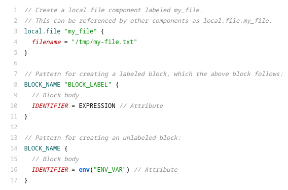

# tree-sitter-river

tree-sitter grammar for the [River](https://grafana.com/docs/agent/latest/flow/config-language/) configuration language.

## Syntax Highlighting Example

## Attributions

Some rules are based on the [tree-sitter-hcl](https://github.com/MichaHoffmann/tree-sitter-hcl) project as river is simmilar to HCL.
